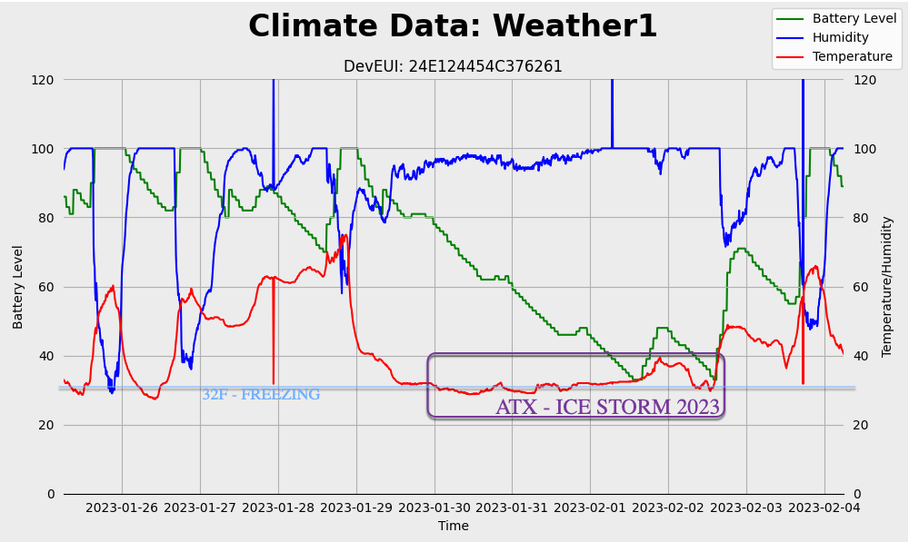

## Milesight - IoT Weather Station - Quick Deploy

This page creates a short note on deploying the Milesight IoT Weather Station:

* Everynet LoRaWAN Coverage and Network Server
* Tartabit IoT Bridge - data pipeline processor
* Azure IoT Central - fleet and data management
* InfluxDB Cloud - data retention

Goal is output like this:

|  | 
| ATX Ice Storm 2023 - Captured by Milesight IoT Weather Station |
|:-:|
