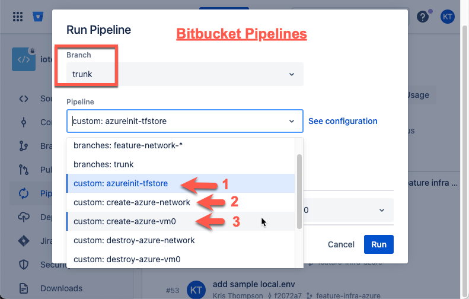

# IoT-Dash - Readme

This repo is used to establish "IoT Dashboard" systems on Cloud hosted applications using Terraform.

The initial terraform code is focussed on Azure hosted resources.

This repo is built on Bitbucket and provides Bitbucket Pipelines to support execution through the use of Repo Variables.

You can run the terraform locally using the same commands seen in the bitbucket-pipelines.yml file. To provide Repo Varibles, setup and source the "local.env" file based on the example provided (in the `infra` folder).

> `cd azure`\
> `source local.env`

You can use the terraform_runner.sh script to execute jobs.

## Terraform_Runner.sh Notes

* If you use an automation pipeline like Bitbucket pipelines, the ENV_NAME and variables are part of the pipeline, and `local.env` is NOT used.

* If using local shell `terrform_runner.sh`, be sure to use `bash`shell (needed for variable interpolation in `env.sh`).

## Terraform Components

Terraform code is intentionally seperated into "components" to keep the "blast-radius" under control. Large monolithic terraform runs make it difficult to manage infrastructure and recover from error.

### Terraform Prep

Assemble Local.env (or Repo Variables)\
The following variables are needed:

1. Azure Resoure Manager (ARM) settings
   * ARM_TENANT_ID=
   * ARM_SUBSCRIPTION_ID=
   * ARM_CLIENT_ID=
   * ARM_CLIENT_SECRET=
   * CIDR_BLOCK=
1. Define a suffix to use for TF State file storge account
   * STATE_SUFFIX=
1. Add the ARM_ACCESS_KEY after the TF State Account is created (below) (if needed)
   * ARM_ACCESS_KEY=

Note: These variables are stored in the `local.env` file with the `${ENV_NAME}_` prefix (e.g. `SAND0_`, `PROD_`). The terraform_runner.sh file sources the env.sh file which normalizes the variables. This method provides support for multiple environments using `PREFIX_` naming.

### TF State - Storage

When creating resources with terraform, it is critical to save and use the Terraform State (tfstate) file. This is stored in an Azure Storage Account.

```shell
cd azure
./terraform_runner.sh azure init
```

Note: It is *normal/expected* to see the following Warning during creation of the terraform state - backend storage account (aka init).

> ```shell
> │ Warning: Missing backend configuration
> ```

After the storage account is created, get an Access Key to use in the `local.env` or Repo Variables.

### Use Terraform to Create Azure Network

With the TF State storage container ready, (add the ARM_ACCESS_KEY if needed), next is the Network.

Run the Terraform script to create the Network.

```shell
./terraform_runner.sh azure network
```

You can also Terraform Destroy (and Plan), not necessarily in that order, by using the plan or destroy keyword.

```shell
./terraform_runner.sh azure network plan
./terraform_runner.sh azure network destroy
```

## Bitbucket Pipelines

If using Bitbucket Pipelines, these are run from the web console as shown below:


### Use Terraform to Create Azure VM0

Use the terraform_runner.sh to plan, create, and destroy VM0 as desired.

```shell
cd azure
./terraform_runner.sh azure vm0
```

Be sure to set the needed variables in azure/vm0/variables.tf and add your own public keys to azure/vm0/pubkeys.
